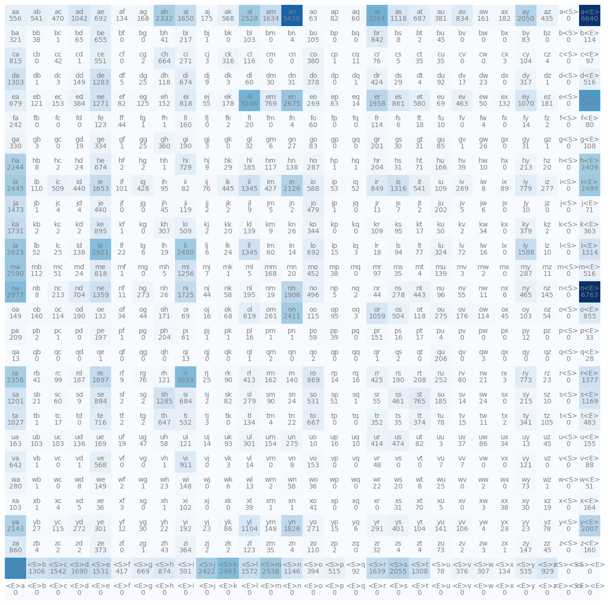
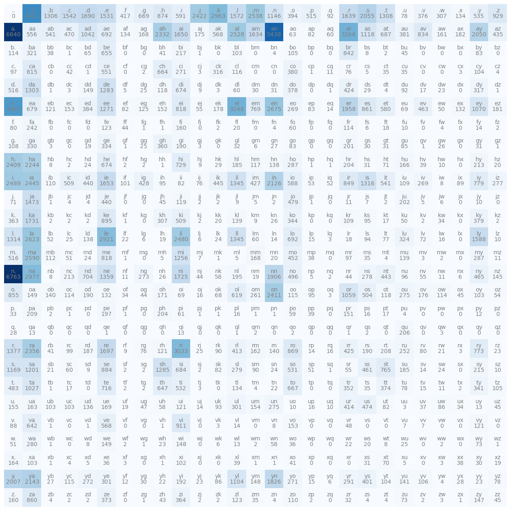

# P2

## 2.1 介绍

这一小节构造一个bigram模型，bigram能够根据输入的单个字符，预测下一个字符。本小节采用两种方法构造，一种是使用传统的统计模型，通过统计出全部结果的概率，从中选取最可能发生的情况。一种是使用神经网络模型。

## 2.1 处理数据

bigram可以根据单个字符预测下一个字符。names.txt中为bigram处理的数据集。

```
words = open('names.txt', 'r').read().splitlines()
words[:10]
len(words)
min(len(w) for w in words)
max(len(w) for w in words)
```

首先打开names.txt文件，words为一个列表。可以查看words的前十个姓名，words的长度，words中姓名长度最长和最短的。

```
for w in words[:1]:
    chs = ['<S>']+list(w)+['<E>']
    #chs:  <S> e m m a <E>
    #chs[1:]:e m m a <E>
    for ch1,ch2 in zip(chs,chs[1:]):
        print(ch1,ch2)
```

words[:1]表示只遍历第一个字符串。用\<S\>表示开始字符，用\<E\>表示结束字符。

zip用于将两个迭代器元素逐个匹配。chs为<S> e m m a <E>。chs[1:]表示跳过第一个字符，为e m m a <E>。因此输出五个字符对，对于每个字符对。第一个字符表示输入的字符，第二个字符表示期望输出的下一个字符。

```
b = {}
for w in words:
    chs = ['<S>']+list(w)+['<E>']
    for ch1,ch2 in zip(chs,chs[1:]):
        #bigram表示一个包含两个字符的元组
        bigram = (ch1, ch2)
        
        b[bigram] = b.get(bigram, 0) + 1
        # print(ch1,ch2)
```

传统方法的核心是概率统计，因此我们需要统计不同字符对出现的次数，根据次数来预测。

b为一个空字典，存储每个字符对出现的次数。dict.get(key, default)表示,如果当前的key在字典存在，返回它当前的值，否则返回默认值default。

统计完成后，我们希望能够按照次数升序排列，而不是只返回一个包含次数的字典。

```
sorted(b.items(), key = lambda kv: -kv[1])
```

sorted默认升序排列，b.items()返回的是一个键值对元组，例如(('e', 'm'), 1)。

第一个参数传入b.items()而不是b。**`sorted()` 的第一个参数是一个“可迭代对象”。**b.items()表示键值对，迭代对象是元组。如果传入b，那么迭代对象为键。

第二个参数传入key，key表示sorted方法按照什么方式排序。冒号前是传入的参数，冒号的后面为返回值。此时kv接受当前键值对，kv[1]表示值。由于sorted（）默认升序，我们希望降序排列。返回值越小，排名次序越靠前。因此直接返回-kv[1]

有了详细的数据之后，我们希望将数据存储到一个二维数组，也就是矩阵中。我们希望矩阵的行表示第一个字符，列表示第二个字符，对应位置处的数据表示出现的次数。

## 2.2 生成热力图

```
import torch
N = torch.zeros((28,28), dtype=torch.int32)
chars = sorted(list(set(''.join(words))))
# print(chars)
stoi = {s:i for i,s in enumerate(chars)}
stoi['<S>'] = 26
stoi['<E>'] = 27
for w in words:
    chs = ['<S>']+list(w)+['<E>']
    for ch1,ch2 in zip(chs,chs[1:]):
        ix1 = stoi[ch1]
        ix2 = stoi[ch2]
        N[ix1, ix2] += 1
itos = {i:s for s,i in stoi.items()}
import matplotlib.pyplot as plt
%matplotlib inline

import os
os.environ['KMP_DUPLICATE_LIB_OK'] = 'TRUE'
plt.figure(figsize=(16, 16))
plt.imshow(N, cmap='Blues')
for i in range(28):
    for j in range(28):
        chstr = itos[i] + itos[j]
        plt.text(j, i, chstr, ha="center", va="bottom", color='gray')
        plt.text(j, i, N[i, j].item(), ha="center", va="top", color='gray')
plt.axis('off');
```

先生成一个28*28的矩阵，这表示26个字母以及起始符和结束符。

当然，有可能有些字母并没有在这份名单中出现过。因此，我们将所有姓名拼接成一个长字符串，利用set去掉重复字符后将其转换为列表，排序后传给chars。

stoi接受一个字典。enumerate(chars)会同时返回一个索引和索引处的值，得到后将其存入字典，对应位置的值作为键，索引作为值。这样会给每一个字母一个独特的数字编号。



注意到某些组合为0，表示出现的概率很少，例如zf、zq。还有一些组合根本不可能出现。例如<E>a表示结束符后面预测的是a，结束符作为最后一个字符，是没有下一个字符的。

## 2.3 改进热力图

观察热力图，我们发现根本没必要采用两个特殊标志表示起始符和结束符。因为单凭位置就可以判断，在前的为起始符，在后的为结束符。

```
import torch

N = torch.zeros((27,27), dtype=torch.int32)

chars = sorted(list(set(''.join(words))))
stoi = {s:i+1 for i,s in enumerate(chars)}
stoi['.'] = 0
itos = {i:s for s,i in stoi.items()}

for w in words:
    chs = ['.']+list(w)+['.']
    for ch1,ch2 in zip(chs,chs[1:]):
        ix1 = stoi[ch1]
        ix2 = stoi[ch2]
        N[ix1, ix2] += 1
```

如下图，我们使用  ‘ . ’  来表示起始符和结束符。这样矩阵从28\*28变成27\*27。


## 2.4 传统方法

次数不太直观，我们注意到对于某一行，相当于固定了起始字符，该行的每一列表示下一个字符可能的组合次数。如果将每一行转换为概率会直观很多。

```
p = N[0].float()
p = p / p.sum()
```

p会变成概率：

```
tensor([0.0000, 0.1377, 0.0408, 0.0481, 0.0528, 0.0478, 0.0130, 0.0209, 0.0273,
        0.0184, 0.0756, 0.0925, 0.0491, 0.0792, 0.0358, 0.0123, 0.0161, 0.0029,
        0.0512, 0.0642, 0.0408, 0.0024, 0.0117, 0.0096, 0.0042, 0.0167, 0.0290])
```

将所有值相加，发现加起来为1，这个过程叫做归一化。

可以按照这个概率随机生成下一个字符，概率大的，预测到该组合的概率也就越大。

```
g = torch.Generator().manual_seed(2147483647)
p = torch.rand(3, generator=g)
p = p/p.sum()
```

g是一个随机生成器对象，可以将它看作一串随机数序列，例如[0.123、0.354、0.244……]，这串序列与后面的种子2147483647密切相关，只要填入相同的种子就会生成相同的随机数序列。

根据g随机生成三个随机数,tensor([0.7081, 0.3542, 0.1054])，这里的三个随机数就是序列开始的三个。

**注意：`g` 是一个随机数生成器。设置相同的随机种子，可以在相同环境和操作顺序下复现随机结果。每次使用 `g` 生成随机数后，其内部状态都会发生变化，因此下一次调用通常会产生不同的随机结果。**

```
torch.multinomial(p, num_samples=20, replacement=True, generator=g)
```

replacement=True表示有放回抽样。num_samples表示生成20个数字。p表示每个索引生成的概率，例如p=[0.3, 0.2 ,0.1, 0.4]，分别表示0-3的生成概率。因为上面rand()里面为3，因此下面只会生成0、1、2。

可以通过下面的方式理解，但不代表真正的实现方式就是如此。

p会划分多个区间：

```
0~0.3：0
0.3~0.5：1
0.5~0.6：2
0.6~1：3
```

当g序列中的随机数为0.23的时候，会落入0~0.3，因此预测为0。

torch.multinomial并不强制要求p必须归一化，只不过归一化能够将权重直接转换成概率，因此采用归一化。

```
g = torch.Generator().manual_seed(2147483647)

ix = 0
while True:
    p = N[ix].float()#第0行表示开头字母
    p = p / p.sum()#归一化转换成概率
    ix = torch.multinomial(p, num_samples=1, replacement=True, generator=g).item()
    print(itos[ix])
    if ix==0:
        break;
```

ix=0是因为必须从起始符.开始，起始符对应的数字编号为0。

不断执行循环，预测下一个字符，直到遇到结束符为止。

```
g = torch.Generator().manual_seed(2147483647)
for _ in range(200):
    out = []
    ix = 0
    while True:
        p = N[ix].float()#第0行表示开头字母
        p = p / p.sum()#归一化转换成概率
        ix = torch.multinomial(p, num_samples=1, replacement=True, generator=g).item()
        out.append(itos[ix])
        if ix==0:
            break;
    print(''.join(out))
```

执行多轮，同时预测多个字符。

每次都要计算一次概率，可以利用广播技术

## 2.5 神经网络

## 2.6 一些可能遇到的问题

在jupyterlab运行下面代码，发现运行一会儿内核直接终止，也没有报任何错误。

```
plt.figure(figsize=(16, 16))
plt.imshow(N, cmap='Blues')
for i in range(28):
    for j in range(28):
        chstr = itos[i] + itos[j]
        plt.text(j, i, chstr, ha="center", va="bottom", color='gray')
        plt.text(j, i, N[i, j].item(), ha="center", va="top", color='gray')
plt.axis('off');
```

重新加载几次，每一次到这里都会卡死。打开任务管理器发现GPU和CPU的利用率很低，再加上数据量比较小，应该不是这两个的问题。后面将代码粘在pycharm中运行，发现报出：

```
OMP: Error #15: Initializing libiomp5md.dll, but found libiomp5md.dll already initialized.
OMP: Hint This means that multiple copies of the OpenMP runtime have been linked into the program. That is dangerous, since it can degrade performance or cause incorrect results. The best thing to do is to ensure that only a single OpenMP runtime is linked into the process, e.g. by avoiding static linking of the OpenMP runtime in any library. As an unsafe, unsupported, undocumented workaround you can set the environment variable KMP_DUPLICATE_LIB_OK=TRUE to allow the program to continue to execute, but that may cause crashes or silently produce incorrect results. For more information, please see http://www.intel.com/software/products/support/.
```

`neural-networks-zero-to-hero` 环境里存在**两个 `libiomp5md.dll` 文件。**

终于找到问题，和P1遇到一样，环境冲突。

在代码前面加入：

```
import os
os.environ['KMP_DUPLICATE_LIB_OK'] = 'TRUE'
```

成功解决！